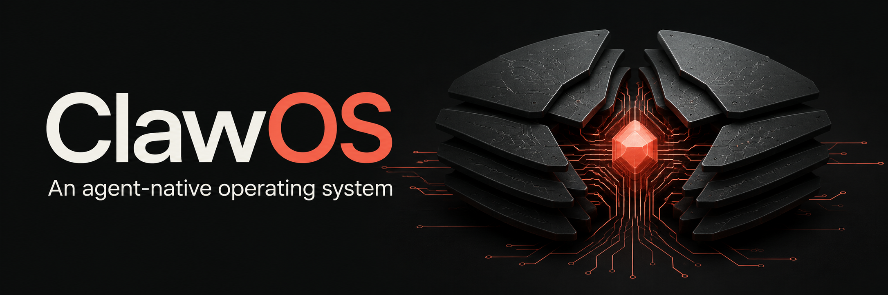

# ClawOS

[](https://github.com/Solvely-Colin/ClawOS/actions/workflows/ci.yml)

An experimental Arch-based OS with OpenClaw as its primary agent interface.
The goal is an agent that can inspect and change its own machine, work on the
ClawOS source, deploy runtime changes live, and return verified results to the
originating conversation. ClawOS owns machine integration and recovery;
OpenClaw owns models, credentials, conversations and agent execution.
Carapace is the intended design language.

ClawOS is an independent project, not affiliated with or endorsed by OpenClaw
or Arch Linux; see [NOTICE.md](NOTICE.md).
This is **public, experimental, unreleased source**, not a production-ready
distribution. There are no releases or tags yet, and every install so far has
been inside a virtual machine. What is and is not in scope is summarized in
[docs/SCOPE.md](docs/SCOPE.md).

[Features](FEATURES.md) · [Roadmap](ROADMAP.md) · [Contributing](CONTRIBUTING.md) ·
[Code map](docs/CONTRIBUTOR-MAP.md) ·
[Hardware support](docs/HARDWARE.md) · [Release builds](docs/RELEASING.md)

## Verified on a fresh VM

On a fresh passwordless installation of a CI-built ISO, without manual runtime repairs:

- A real OpenClaw agent edited a runtime source file and deployed it from inside the guest.
- Checkpointed deployment and file-level rollback passed; all 101 managed targets
  returned to their prior contents, permissions and ownership.
- The same conversation continued after restart. Simulated acknowledgement loss
  was retried without a duplicate completion notice in native history.

See the [dated run and limits](docs/HARDWARE-INSTALLER-VALIDATION.md#2026-09-10-full-agent-loop-on-the-corrected-ci-image).
This proves the tested runtime-file loop, not arbitrary OS recovery, hardware
compatibility or containment of an untrusted agent. Startup and UX rough edges
remain in [known issues](docs/KNOWN-ISSUES.md).

**Installer boundary:** the experimental installer accepts eligible blank SATA,
NVMe, virtio and eMMC disks on x86_64 UEFI systems and refuses boot media,
mounted/in-use disks and nonblank disks. It has only ever run in virtual
machines: a full `--passwordless` install plus reboot and an encrypted install
were verified on Windows QEMU (WHPX) on 2026-09-06/07
([validation record](docs/HARDWARE-INSTALLER-VALIDATION.md)). No physical
machine has been installed. Installed systems enable `sshd` (key-only: password
and root login are refused) and `tailscaled`. In encrypted mode the disk
passphrase is also the `root` and `clawos` account password; the passwordless
option leaves both accounts with empty passwords, no encryption and no screen
lock. "Full Root" means the `clawos` account has passwordless sudo. See
[hardware support](docs/HARDWARE.md).

## Start contributing

Read [CONTRIBUTING.md](CONTRIBUTING.md) and [known issues](docs/KNOWN-ISSUES.md).
Use a disposable Linux VM, not your daily-driver installation. A step-by-step
build and install walkthrough, with a verification marker on every step, is in
[docs/GETTING-STARTED.md](docs/GETTING-STARTED.md).

Help is especially useful on [startup readiness](https://github.com/Solvely-Colin/ClawOS/issues/53),
[display scaling and pointer alignment](https://github.com/Solvely-Colin/ClawOS/issues/54),
and [keeping supporting surfaces attached to their task](https://github.com/Solvely-Colin/ClawOS/issues/55).
For a smaller first contribution, start with the
[contributor guide](CONTRIBUTING.md#finding-work) and its scoped documentation/CI tasks.

On Arch Linux, review and install build dependencies, then run the source gate:

```sh
./image/bin/install-build-deps
./image/bin/preflight-iso
```

Without Arch, run the same gate in the `archlinux:base-devel` container CI
uses, with Docker or Podman: `tools/dev/preflight-in-container.sh` (see
[CONTRIBUTING.md](CONTRIBUTING.md#running-the-source-gate-without-arch)).

For non-privileged unit checks on Linux with Python 3.12+ and Node 24+:

```sh
python3 -m unittest discover -s image/tests -p 'test_*.py'
python3 -m unittest discover -s services/clawosd/tests -p 'test_*.py'
node --test integrations/openclaw/test/*.test.js
```

See [image build instructions](image/README.md) for ISO construction and disposable-disk
testing, and [live development](docs/SELF-DEVELOPMENT.md) for checkpointed runtime
deployment. ISO builds run inside Linux. Windows manages QEMU through the
[host launcher scripts](tools/windows/README.md).

## Code map

| Path | Purpose |
| --- | --- |
| `image/` | ArchISO, installer, shell, onboarding, runtime deployment and checks |
| `integrations/openclaw/` | Machine tools, activity integration and deployment notices |
| `services/clawosd/` | Privileged broker, approval UI, recovery and tests |
| `tests/integration/roles/` | Standalone/remote-node role-switching tests |
| [`experiments/shell-prototype/`](experiments/shell-prototype/README.md) | Frozen 2026-08 visual prototype, not the installed OS runtime; dependency/build/browser smoke checks run in CI |
| [`experiments/host-session/`](experiments/host-session/README.md) | Historical 2026-08 host-side kiosk experiment; only its static check still runs, as `preflight-iso` stage 2 |
| `tools/windows/` | Host lifecycle source, without VM images or credentials |

## Evidence and limits

All evidence so far comes from virtual machines. The development VM has
demonstrated runtime deployment, file-level rollback, native provider/model
setup, high-impact broker approvals, and idempotent completion notices; fresh
QEMU/WHPX guests have completed encrypted and passwordless installs and booted
without the ISO. Unit checks are not proof of fresh installation, arbitrary OS
rollback, hardware compatibility or safe root-agent behavior. Full Root
intentionally grants the `clawos` account unrestricted passwordless sudo.
Every ISO proof is a row in [the evidence ledger](docs/EVIDENCE.md).

Local working notes and retired milestone reports are not part of the public
documentation. Start with the [architecture](docs/ARCHITECTURE.md), current
roadmap and dated evidence; do not treat old Git history as release acceptance.

ClawOS is released under the [MIT License](LICENSE). Third-party components,
derived configuration files and artwork keep their own licenses and are listed
in [NOTICE.md](NOTICE.md). Security expectations and how to report a problem
are in [SECURITY.md](SECURITY.md). Use the
[public-release checklist](docs/PUBLIC-RELEASE-CHECKLIST.md) before announcing
installable releases.
