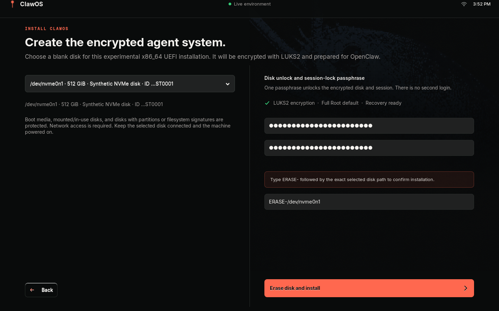

# Hardware-capable installer validation

The VM-only guard is replaced by a blank-disk safety policy. This change is
experimental and has not yet been used to install a physical machine.

## Initial source-only checks (historical)

- Eleven target-policy tests: SATA/NVMe/virtio/eMMC naming, partition naming,
  boot-media exclusion, unknown boot source, mounted/swap/read-only/holder
  rejection, existing partitions/filesystems, minimum capacity, stale identity,
  kernel disk-generation changes, exact confirmation and raw filesystem signatures.
- Full Arch preflight: 35 M1 tests, 21 broker tests, 26 plugin tests and existing
  profile/onboarding/role integration checks passed.
- Suite sizes move; count them rather than trusting prose. At `00f81c5` in the
  builder VM, `python3 -m unittest discover -s image/tests -p 'test_*.py'` reported
  49 tests, the same command over `services/clawosd/tests` reported 27, and `node --test
  integrations/openclaw/test/*.test.js` reported 28.
- Bash syntax and ShellCheck passed for the installer, excluding only SC1091
  for its installed `/etc/clawos/versions.env` include.
- The new discovery helper was run on the installed development workstation and
  correctly refused it because installation is restricted to the live ISO.
- A synthetic GTK preview confirmed no default disk, wrong-target rejection and
  enabling only after the exact selected path and matching passphrases. Its
  installer and reboot methods were replaced with no-op preview handlers.
- No physical or virtual target was partitioned or formatted by those initial checks.

## Download-failure regression checks (2026-09-07)

The original `47b6e44` candidate failed fresh encrypted NVMe and passwordless
SATA installs when Arch archive transfers timed out after partitioning. The fix
prepares and verifies the complete package set before the first disk write,
uses bounded retries, and installs from local packages with required signatures.
OpenClaw is bundled during ISO construction with executable modes preserved.

- Full Linux preflight and four package-preparation regression tests passed.
- A clean ISO passed boot-chain, bundled-version and executable-entry validation.
- In a fresh QEMU guest, disabling networking for the actual installer exhausted
  all three attempts. The disk checksum, absent partition table and blank-disk
  eligibility remained unchanged.
- The encrypted NVMe installation recovered from an HTTP/2 stream reset during
  package preparation, completed, and booted without ISO media through its
  registered Linux Boot Manager entry. LUKS unlock, desktop/onboarding entry,
  pinned OpenClaw execution, broker and SSH services passed.
- Passwordless SATA installation completed on its first preparation attempt and
  booted without ISO media through its registered firmware entry. Plain Btrfs,
  empty account passwords, disabled locking, SSH's `PermitEmptyPasswords no`,
  pinned OpenClaw and onboarding entry were checked. An unprivileged `claw`
  account could not switch to root with an empty password.
- The passwordless Windows/WHPX guest initially showed a blank frame and stalled
  SSH, then recovered after keyboard input. Immediate unattended first-paint
  responsiveness is not established by this run; the cause remains unconfirmed.
- No installed serial-root autologin was enabled. Post-boot inspection used a
  test-only SSH public key; no provider account or production secret was used.
- Physical hardware and complete provider enrollment/model inference remain
  outside these QEMU checks.

Tested fast ISO SHA256:
`8826f15d050678130ba1700bc47d2222c7c82b61b0105df5d6cfd0fd7099a5fc`.
The image contains the download-fix working tree based on `47b6e44`; both tests
used Windows-managed QEMU/WHPX, 4 GiB RAM, fresh 40 GiB virtual disks and UEFI
variables, and omitted `--vm-test`. All VM shutdowns were guest/ACPI-driven.

## Required before broader release claims

- [x] Build an ISO from the candidate source and pass ISO validation.
- [x] Run fresh QEMU SATA and NVMe installation tests, not only virtio.
- [ ] Verify boot media and mounted/signature-bearing disks are refused in that ISO.
- [x] Verify UEFI boot, encryption unlock and the OpenClaw onboarding entry screen.
- [ ] Complete provider enrollment and verify real agent inference after installation.
- [x] Repeat the QEMU install without `--vm-test` (NVRAM-writing bootctl path)
  and once with `--passwordless`, confirming direct boot to the desktop with no
  passphrase prompt and no screen lock.
- [ ] Test at least one blank-disk physical x86_64 UEFI machine and publish its
  redacted model/firmware/storage results.
- [ ] Expand hardware coverage without weakening disk-protection checks.

The ordinary installer no longer configures serial-root autologin, and the live
ISO's own `ttyS0` autologin is now conditional on the Q35 KVM machine. The
explicit `--vm-test` path retains installed autologin solely for the existing
integration harness. A `--passwordless` mode (no encryption, empty account
passwords, no screen lock) exists for people who accept that risk explicitly.
Existing partitions, Secure Boot, legacy BIOS, RAID/multipath and non-x86_64
installation remain outside this first implementation.

## 2026-09-07: sshd policy and both install modes re-verified

ISO `clawos-fast-2026.09.07-x86_64.iso` (SHA-256
`11ccf162b6bab582f07d43b10312b43ee1e0fde8008355a5c6963ad7ff764d3d`, built from
`ee2f4f1` in the builder VM and checksum-verified after transfer; the 09-06
image was `dbc1f556…8c4094`) on Windows QEMU (WHPX, OVMF), fresh 32 GiB
virtio disk and fresh firmware variables per run, installer driven from the
live `tty1` root shell. `systemd-detect-virt` reports `qemu`, so this is the
hardware branch, not `--vm-test`.

- Encrypted install: exit 0, `Linux Boot Manager` and fallback entries
  created, first boot through `Boot0004`, LUKS unlocked with the typed
  passphrase, root login with the same passphrase.
- Passwordless install: exit 0, same boot entries, first boot to the login
  prompt with no passphrase, root login with no password.
- On both installed systems: `sshd -T` reports `PasswordAuthentication no`,
  `KbdInteractiveAuthentication no`, `PermitRootLogin no`; the drop-in is
  `/etc/ssh/sshd_config.d/00-clawos.conf`; `clawos-session@clawos`, `clawosd`,
  `sshd`, `NetworkManager` and `tailscaled` active, zero failed units, Sway
  running, `clawosctl status` at `full-root`, `tailscale status` logged out.
- The live ISO in that image still reported `PasswordAuthentication yes`
  because archiso's `10-archiso.conf` sorted ahead of the drop-in; the drop-in
  was renamed to `00-clawos.conf` afterwards (`7244a54`) and that live-side
  fix has not been rebuilt into an ISO yet.
- Not exercised: the GTK installer path (driven from tty1), onboarding past the
  first screen, physical hardware.

## 2026-09-08: live side of a CI-built ISO observed with key-only sshd

The `release.yml` run 34270708295 artifact (`clawos-2026.09.08-x86_64.iso`,
SHA-256 `9442e105d287c300e08b8ce9821859fa684067d761afd3b69491552a956816fd`,
`BUILD-METADATA.txt` source commit `00f81c5`) was booted live on Windows QEMU
(WHPX, OVMF) with no install. From the live `tty1` root shell:

- `/etc/ssh/sshd_config.d/` lists `00-clawos.conf 10-archiso.conf
  20-systemd-userdb.conf 99-archlinux.conf`, so the ClawOS drop-in is read first.
- `sshd -T` reports `PermitRootLogin no`, `PasswordAuthentication no`,
  `KbdInteractiveAuthentication no`, `PermitEmptyPasswords no`.
- `sshd` is active and listening on port 22 (IPv4 and IPv6); the live `root`
  account has no password and root login is refused, so no account can log in
  over SSH until a key is installed for `clawos-live`.

This replaces the 2026-09-07 note that the live-side fix had not been rebuilt
into an ISO. It is the first observation of a CI-built image. Ledger row added.

## 2026-09-10: graphical encrypted install and default onboarding on the CI ISO

Source `de19c1bccc839a47696afd4c7009f6717c43d934`, `release.yml` run
[34432248984](https://github.com/Solvely-Colin/ClawOS/actions/runs/34432248984),
ISO SHA-256 `119768a247fd5e76f15a0df1914f554cc9bd2f5f4a53db3c810d68693a5ede32`.
Get-CiIso verified workflow identity, source metadata and checksum. Windows
QEMU 11.1/WHPX with OVMF, 8 GiB RAM, a fresh 40 GiB NVMe qcow2 disk and fresh
firmware variables; 1440x900 display. No `--vm-test`, source patch or provider
credential was used. The existing public SSH key was added locally only for
inspection; SSH policy was not changed.

- Unmodified image: Welcome, Inspect system and graphical Install worked.
  No disk was selected by default. Back/Erase remained visible with the layout
  fix included in the ISO. Selected the only blank disk, entered a synthetic
  passphrase twice and its exact `ERASE-/dev/nvme0n1` confirmation.
- `pkexec` launched the installer without a dialog. Archive and capacity checks
  passed (1130 MiB download; 3955 MiB temporary capacity). Archive connection
  resets caused retries; attempt 3 completed using cached downloads. Package
  integrity checking preceded `CLAWOS_INSTALL_DISK_WRITE_STARTED` and partitioning.
- GTK reported Installation complete. Clicking Restart into ClawOS requested a
  normal guest reboot. The host's `-no-reboot` setting let QEMU exit normally
  (task result 0); an offline image check and checkpoint were taken, then the
  disk was launched without ISO media. QMP confirmed the CD device was empty.
- The installed boot entry loaded, the typed LUKS passphrase unlocked the disk,
  and setup appeared without a second graphical login. Recovery tty3 login as
  `clawos` with the same password worked.
- Graphical onboarding: This machine, choose a model later, default Full Root.
  No policy dialog required input. The live `/api/status` response changed from
  `setupComplete: false`, `stage: start` to `setupComplete: true`, `stage: complete`,
  `mode: local`, `access: full-root`, `selectedModel: null`. Captured before
  closing setup; its temporary server exits after workspace entry.
- Enter Agent workspace opened the real OpenClaw 2026.8.2 Control UI at model
  setup, as expected with provider configuration deferred. This is not inference proof.
- Both live and installed `sshd -T`: PermitRootLogin, PasswordAuthentication,
  KbdInteractiveAuthentication and PermitEmptyPasswords all `no`. Installed
  drop-ins: `00-clawos.conf`, `20-systemd-userdb.conf`, `99-archlinux.conf`.
  Successful public-key SSH was observed. Host forwarding intermittently timed
  out during bootstrap/downloads; the recovery console remained usable. The
  final SSH read used `IPQoS=none`; a causal fix for those timeouts is not proven.
- Installed `clawosd`, `sshd`, NetworkManager, tailscaled, clawos-session@clawos,
  and the user openclaw-gateway service were active; no failed system-unit rows.
  Broker level was full-root. Root was Btrfs `@` over the LUKS mapper.
- Before any `tailscale up`, Tailscale 1.102.3 reported NeedsLogin with no tailnet
  or assigned Tailscale IP. It nevertheless listened on UDP 41641 on IPv4/IPv6.
  SSH listened on TCP 22 on both families; after onboarding Gateway listened on
  loopback TCP 18789. The setup server had used loopback TCP 19401 and then exited.
- Shutdown through SSH `sudo systemctl poweroff` completed normally. Final image
  check passed and a separate configured disk/firmware checkpoint was retained.

ISO, manifests, build logs, screenshots, API output and listener observations
are retained privately. This supersedes the default encrypted GTK/onboarding
gaps above, not the historical results. Passwordless GTK, non-default policy
dialogs, remote Gateway, provider login/inference, live-update/rollback, KVM/TCG
and physical hardware are not established by this run.

## 2026-09-10: fresh passwordless agent loop and installer defect

A new 40 GiB virtio disk was installed from CI ISO run 34432248984 (source
`de19c1bccc839a47696afd4c7009f6717c43d934`, SHA-256
`119768a247fd5e76f15a0df1914f554cc9bd2f5f4a53db3c810d68693a5ede32`).
Windows QEMU/WHPX, Q35/OVMF and 8 GiB RAM were used. Installation invoked the
normal passwordless CLI with disk-serial/identity/exact-confirmation checks,
not GTK and not `--vm-test`. A temporary live operator account and the existing
public SSH key supplied test access; root/password SSH authentication stayed off.
The installed system booted without the ISO, with Btrfs root on `/dev/vda2[/@]`.
An offline disk check and `before-agent-enrollment` checkpoint preceded setup.

Machine setup used the loopback setup API in local/Full Root mode. Provider
enrollment used OpenClaw's native credential CLI, not a copied auth database or
conversation history. A real `ollama-cloud/minimax-m2.7` request passed (run
`1f944d9a-63a7-4b39-84ba-54f60155662f`). Source preflight passed on checkout
`aad78292095bfc94072af578b159c18ac70b5f1a` after installing standard build tools
from the same pinned Arch snapshot. Archive low-speed timeout and intermittent
WHPX SSH forwarding failures were observed; retry and an additional loopback
forward restored access, without establishing their root cause.

**The unmodified image failed live-update readiness.** `clawos-deploy` existed
as root-owned mode 0644, and the delivery service/timer were absent. Consequently
`deploy-runtime plan` failed with `sudo: ...clawos-deploy: command not found`.
A read-only Btrfs snapshot preceded a narrow repair: executable mode on that
file, installation of the two delivery units, and enabling the timer. The
installer/profile fix and a new installed-boot assertion are in PR #99.

The following is **repaired-guest evidence**, not an unmodified-image pass:

- The guest agent added one harmless comment to `integrations/openclaw/lib/embodiment.js`
  and dispatched apply itself in its existing conversation. Run
  `008f4f87-fe54-4cb9-93e6-a24d308f4cc3`; deployment
  `db4891f1-d46b-4654-b885-a2d0836f992c` completed in 33 seconds, health verified,
  manifest drift empty, with its own root snapshot and file backup.
- A temporary runtime-only systemd condition held the delivery service. The
  real Gateway append was invoked and its acknowledgement deliberately discarded,
  without editing OpenClaw state or the deployer's pending record. Releasing the
  condition let normal delivery retry; native history contained exactly one
  completion notice with the job/outcome idempotency key.
- The same agent invoked the explicitly authorized file-level rollback. Run
  `08b02ee4-c662-4f76-beca-22496a275c5c`; rollback completed in 26 seconds with
  health verified. Independent comparison of all 101 runtime targets found zero
  differences in content hashes, modes, ownership or existence versus the
  pre-update baseline. The original null installed manifest was restored.
- Native history confirmed the same session ID, one update notice and one
  rollback notice, with no truncated history. A further real agent turn read
  the rolled-back receipt and returned the expected verification response
  (run `04e3355b-cbdf-4ca2-8071-e3b1a4c02014`).
- The delivery-test condition was removed; the normal timer was active, no
  system units were failed, and effective SSH still refused root/password/
  keyboard-interactive authentication. The source comment remained separate
  from installed-file rollback, as intended.

Raw transcripts and credentials remain private; retained response/history
evidence was secret-pattern scanned. This is not both-mode GTK acceptance,
non-default policy-dialog proof, full-system rollback, physical-hardware proof,
or a complete run on a corrected, unmodified release candidate. Issue #33 stays
open for those remaining prerelease requirements.

### Corrected installer: unmodified hosted-KVM proof

[CI run 34519540819](https://github.com/Solvely-Colin/ClawOS/actions/runs/34519540819)
at `4e9767f44bc410a386e7247720392a54247ced2b` built ISO SHA-256
`081ec3fe13d54f6204836eff23ce420fcc92fec712edf9981a5026c27dce08d2`.
The live gate and fresh passwordless install/disk-only boot gate passed without
manual repair. The new `DEPLOY_READY_OK` assertion verified executable updater
mode, CLI startup, the delivery service file and enabled timer. All other
installed markers, ACPI shutdowns and the offline disk check passed.
Artifact 10170028322 contained only scanned evidence, not the ISO or disk;
it was downloaded and re-scanned, and its desktop screendump was inspected.
This KVM gate uses `--vm-test`; it does not rerun provider enrollment or the
full agent loop on this corrected binary. Later commits change documentation
only. No release or publicly retained ISO was created.
